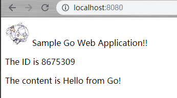
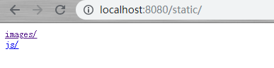
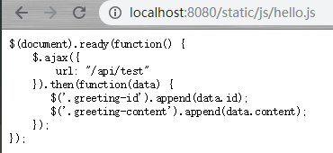
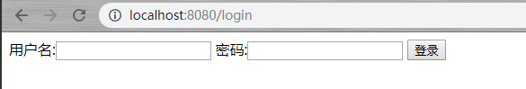
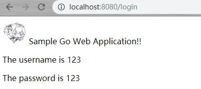
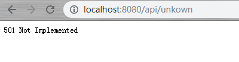
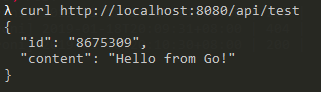
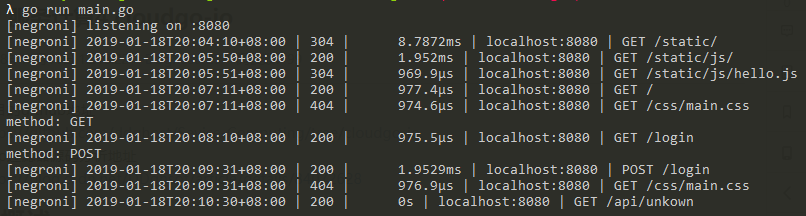

## CloudGo-IO

### 1、概述

设计一个 web 小应用，展示静态文件服务、js 请求支持、模板输出、表单处理、Filter 中间件设计等方面的能力。（不需要数据库支持）

### 2、任务要求

编程 web 应用程序 cloudgo-io。 请在项目 README.MD 给出完成任务的证据！

**基本要求**

1. 支持静态文件服务
2. 支持简单 js 访问
3. 提交表单，并输出一个表格
4. 对 `/unknown` 给出开发中的提示，返回码 `5xx`

### 3、完成概述

1. 运行

```
go run main.go
```

>  代码主体来自老师的[博客](https://blog.csdn.net/pmlpml/article/details/78539261)，有关表单处理参考教程[4.1 处理表单的输入](https://github.com/astaxie/build-web-application-with-golang/blob/master/zh/04.1.md)

2. 测试

   - 主页

     访问http://localhost:8080，这是博客中的简单主页

     


   - 支持静态文件服务

     访问http://localhost:8080/static可查看静态文件

     

   - 支持简单 js 访问

     访问http://localhost:8080/static/js/hello.js可查看hello.js

     

   - 提交表单，并输出一个表格

     访问http://localhost:8080/login，第一次访问方式为GET

     

     输入用户名密码后，点击登录，此时访问方式为POST，得到页面

     

   - 对 `/unknown` 给出开发中的提示，返回码 `5xx`

     访问http://localhost:8080/api/unkown，得到开发中的提示

     

   - 运行网站并用 curl 测试输出

     

   - 以上测试命令行输出

     